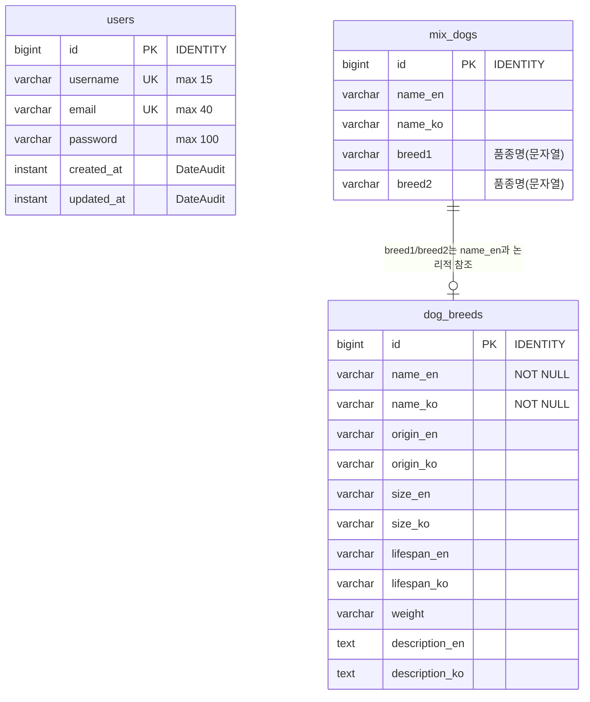

# 🐶 Deep_Bark

> **AI 품종 분석과 위치 기반 정보를 결합한 맞춤형 반려견 케어 플랫폼**  
> 🔗 [배포 링크] | 📄 [Notion 문서](https://www.notion.so/Deep_Bark-2df87486686f814082aaf9d3babd0281)

<br>

## 📖 프로젝트 소개 (About)

**Deep_Bark**는 반려견의 사진을 AI로 분석하여 믹스견/순종견 여부와 품종을 예측하고, 위치 기반 서비스를 통해 다양한 맞춤형 정보를 제공하는 모바일 애플리케이션입니다.

- **제작 기간:** 2025.03.07 ~ 2025.04.22
- **참여 인원:** 6명 (팀장)
- **주요 역할:**
    - 데이터 수집 및 전처리, 프로젝트 진행 조율
    - Git 형상 관리
    - 앱 개발 및 AI 모델 연동

<br>

## ✨ 주요 기능 (Key Features)

- **📸 AI 품종 분석:** 반려견 사진을 분석하여 품종 및 믹스견 여부 판별
- **🗺️ 위치 기반 케어:** 주변 동물병원, 산책로, 반려견 동반 가능 장소 추천
- **📝 맞춤형 정보:** 품종별 특성(성격, 질병 취약점 등) 및 관리 팁 제공
- **🐕 커뮤니티:** 반려견주 간 정보 공유 및 소통

<br>

## 🛠 기술 스택 (Tech Stack)

| 구분 | 스택 |
| :-- | :-- |
| **Frontend(App)** | (e.g. Flutter / React Native / Android Native) |
| **AI/ML** |  (e.g. YOLO, EfficientNet) |
| **Backend** | (e.g. Django / Spring Boot) |
| **Database** | (e.g. MySQL / PostgreSQL) |
| **Tools** |   |

<br>

## 🏗 아키텍처 및 설계 (Architecture & Design)

### ERD (Entity Relationship Diagram)
- **Users**: 사용자 계정 정보 (이메일, 비밀번호 등)
- **Dog Breeds**: 품종 정보 (이름, 크기, 수명, 설명 등)
- **Mix Dogs**: 믹스견 구성 정보 (부모 품종 매핑)



### API 명세서
- 상세 API 명세는 [Google Docs 링크](https://docs.google.com/document/d/1lT0DWiJp5N4XNDKPadgsbukJPJSWQ1v2ulH8anghz00/edit?usp=sharing)에서 확인할 수 있습니다.

<br>

## 💭 회고 (Retrospective)

- **[Notion 회고록 링크]** (상세 내용은 링크 참조)
- **배운 점:** AI 모델 학습 데이터 전처리 중요성 및 위치 기반 서비스 구현 노하우
- **아쉬운 점:** (e.g. 초기 모델 정확도 개선 과정에서의 시행착오)

<br>

## 💻 설치 및 실행 (Installation)

```bash
# 1. Clone the repository
git clone https://github.com/Ihan0316/Deep_Bark.git

# 2. Install dependencies
# (Instructions for App or Backend setup)
```
